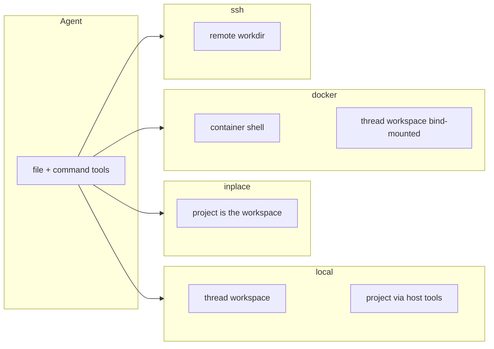

# Choose a sandbox backend

Language: [简体中文](/zh/pagentv4/backends) | English

pagent gives the agent a **companion computer** (the sandbox). There are **four
user-facing backends**. They are siblings, not flavors of each other:

| Config value | Desktop / VS Code label | One sentence |
|--------------|-------------------------|--------------|
| `local` | 本机 | Isolated scratch workspace on this machine |
| `inplace` | 直接编辑 | Edit the bound project directory in place |
| `docker` / `podman` / `container` | 容器 | Commands run in a container; files stay in the thread workspace |
| `ssh` | SSH / 远程 | Commands and files on a remote host |

`inplace` is **not** “inplace-docker” or “inplace-ssh”. Docker, SSH, and local
do not “run inplace”; only `backend = "inplace"` writes the project directly.

API details (Runner, `Sandbox.create`, errors) stay on [Sandbox](./sandbox).
This page is the map: what each backend touches, when to pick it, and the
mix-ups that come up in the UI.

::: warning Most common mix-up: `local` plus “agent, ssh there yourself”
A **`local`** session where you tell the model “ssh to that box and run it”
is **not** the `ssh` backend.

- `run_command("ssh host …")` is just another subprocess in the local workspace
- `read_file` / `write_file` / `list_dir` still hit this machine’s
  `workspaces/main/`
- Approvals, timeouts, resume, and the file tree are all local; pagent never
  sees remote files

If the work belongs on the remote host: new task → **SSH / 远程**, or
`[sandbox] backend = "ssh"`. Every tool then uses one asyncssh connection.
Do not ask the model to assemble `ssh` by hand. Same idea: do not use
`docker run` inside `local` as a substitute for the container backend.
:::

## Mental model: two directories

Every session has two roots. Mixing them up is the usual source of confusion.

```text
Agent paths          /home/agent/...     ← what the model sees
                     ↕ mapped by backend
workdir              where run_command / read_file / write_file actually go

host_root            the bound project on your machine
                     list_host_files / copy_from_host / copy_to_host only
```

| Directory | Typical location | Who uses it |
|-----------|------------------|-------------|
| **workdir** (agent computer) | `local` / `docker`: `~/.pagent/threads/<id>/workspaces/main/` · `inplace`: the project itself · `ssh`: remote `~/pagent` (or `[sandbox.ssh] workdir`) | `run_command`, `read_file`, `write_file`, `str_replace`, `list_dir` |
| **host_root** (your project) | `[project.local] path` or `--project` / Desktop “项目目录”; empty → process cwd | `list_host_files`, `copy_from_host`, `copy_to_host` → `<host_root>/artifacts/` |

`inplace` **collapses** the two: workdir and host_root are the same folder.
Host-bridge tools are omitted because there is nothing left to copy.



## Side-by-side

| | `local` | `inplace` | `docker` / `podman` | `ssh` |
|---|---|---|---|---|
| Where commands run | This machine, in the thread workspace | This machine, in the project | Inside the container | Remote host |
| Where file tools write | Thread workspace | **The project** | Thread workspace (bind-mounted into the container) | Remote workdir |
| Isolated from the repo? | Yes, until you copy | **No** | Yes, until you copy | Yes, relative to your laptop |
| Needs extra software | No | No | Docker or Podman + an image | SSH config + reachable host |
| Host-bridge tools | Yes | **Removed** | Yes | Yes |
| Desktop sandbox file tab | Shown | Hidden (use **项目**) | Shown | Shown |
| Frozen in `thread.toml` | `backend` | `backend` + `project.path` | `backend` + `image` | `backend` + SSH fields |
| Resume from another cwd | Same workspace | **Same project path** | Same workspace | Same remote workdir |

`container` is not a fifth mode. It picks `docker` or `podman` from `PATH`
(docker first). `docker` and `podman` are the same design with a different CLI.

## `local` — isolated workspace on this machine

Default. Closest to “give the agent a scratch disk.”

```text
~/.pagent/threads/<thread_id>/
  thread.toml
  messages/
  workspaces/main/     ← agent /home/agent
```

The bound project is **read/copy only** through host tools. Edits in the
workspace do not change the repo until `copy_to_host` (into `artifacts/`) or
you copy by hand.

**Use when:** trying pagent, generating throwaway files, or keeping the repo
untouched until you accept an artifact.

```toml
[sandbox]
backend = "local"

[project.local]
# path = "/path/to/repo"   # host_root; empty → cwd at start
```

## `inplace` — edit the project in place

This is the coding-CLI mode (`pagent -C .`). The agent’s `/home/agent` **is**
the project. `write_file` / `str_replace` / `run_command` hit the real tree
immediately.

Required: a project directory (`--project`, `-C`, Desktop 项目目录, or
`[project.local] path`). The path is frozen in `thread.toml`, so resume keeps
editing the same folder even if you start pagent elsewhere.

Tools: `run_command`, `read_file`, `write_file`, `str_replace`, `list_dir`.
`list_host_files` / `copy_from_host` / `copy_to_host` are stripped — the
project already *is* the working directory.

**Use when:** you want the agent to work like Cursor/Claude Code on a git
checkout. Keep the tree in version control and review tool approvals
(`permission.mode = "prompt"` by default).

Shortcut:

```bash
pagent -C .                    # current directory
pagent -C /path/to/project     # another directory
# same as: pagent --backend inplace --project <dir>
```

Safe first run (throwaway folder, not your real repo):

```bash
mkdir -p /tmp/pagent-inplace-test
echo "alpha" > /tmp/pagent-inplace-test/hello.txt
pagent -C /tmp/pagent-inplace-test
```

Ask it to replace `alpha` with `beta` in `hello.txt`, then:

```bash
cat /tmp/pagent-inplace-test/hello.txt   # beta
```

Conversation metadata still lives under `~/.pagent/threads/`. There is **no**
separate `workspaces/main/` for this mode.

```toml
[sandbox]
backend = "inplace"

[project.local]
path = "/path/to/project"
```

## `docker` / `podman` / `container` — commands in a container

Commands run **inside** the image. The thread workspace is bind-mounted at the
**same host path** inside the container (`-v <workdir>:<workdir>`). File tools
therefore still write on the host workspace, not into the image layer, and not
into your project unless you use host-bridge tools.

This is **not** inplace: the repo is not the container workdir.

Needs: CLI on `PATH` and a local image (`[sandbox.container] image`). Missing
images are not pulled automatically; `docker run` fails and the UI surfaces it.

**Use when:** you want a known Linux userland (compilers, Python, headless
browser) without installing them on the Mac, while keeping files on disk.

```toml
[sandbox]
backend = "container"   # or docker / podman
# tools = [...]

[sandbox.container]
image = "pagent:latest"
container_ttl = 300       # seconds; 0 / unset → sleep infinity
```

Browser / screenshot image:

```bash
docker build -t pagent:browser -f src/app/Dockerfile.browser src/app
```

Then set `image = "pagent:browser"`.

Python API:

```python
runner = await Runner.create(
    "demo",
    provider,
    overrides={"backend": "docker", "image": "python:3.12-slim"},
)
```

## `ssh` — remote host

`run_command` and file tools use one long-lived `asyncssh` connection. The
agent’s `/home/agent` maps to the **remote** workdir (`[sandbox.ssh] workdir`,
default `~/pagent`, created if missing). Host-bridge tools still talk to the
**local** `host_root`.

Needs: `host` as a `Host` alias in `~/.ssh/config` (User / Hostname / IdentityFile
as usual). Connect uses `connect_timeout=10s` and `login_timeout=15s` so a dead
host fails instead of hanging the UI.

**Use when:** the job belongs on a GPU box, HPC, or a machine that already has
the toolchain. Do not stay on `local` and ask the model to `ssh`; that only
starts a local client, and file tools still write locally.

```toml
[sandbox]
backend = "ssh"

[sandbox.ssh]
config_path = "~/.ssh/config"
host = "machine_root"     # Host alias, not user@hostname
workdir = "~/pagent"
```

```python
runner = await Runner.create(
    "remote",
    provider,
    overrides={
        "backend": "ssh",
        "ssh_host": "machine_root",
        "ssh_workdir": "~/pagent",
    },
)
```

## How to choose

1. **Just chat / generate files I will copy later** → `local`
2. **Refactor this git repo on my laptop** → `inplace` (`pagent -C .`)
3. **Need Ubuntu packages / a pinned image, keep files on this machine** → `container` / `docker`
4. **The work must happen on another computer** → the **`ssh` backend**
   (do not stay on `local` and tell the model to ssh)

Decision shortcuts:

- “Will `write_file("app.py")` change my repo?” Only **`inplace`**.
- “Do I need Docker?” Only **container family**.
- “Is the project mounted into the sandbox?” **`inplace`**: the project *is* the
  sandbox. **`local` / `docker`**: the project is host_root; copy in/out.
- “Can I resume on another laptop?” `local`/`docker` workspaces stay on the
  original machine’s disk. `inplace` is that machine’s project path. `ssh` is
  whatever remote you configured.

## Config and freeze

Global `pagent.toml` is the default for **new** threads. Each thread freezes
backend + project + image/SSH into its `thread.toml`; later `pagent.toml`
edits do not rewrite an existing conversation.

Desktop **新建任务** can override per session. Labels:

| UI | `backend=` |
|----|-------------|
| 本机 | `local` |
| 直接编辑 | `inplace` |
| 容器 | `container` (or `docker` / `podman`) |
| SSH / 远程 | `ssh` |

Onboarding “沙箱” picks a **preferred** default; you still choose per task.

## Common mix-ups

**`local` plus the agent running `ssh` / `docker run`**  
The backend is where **every** tool lands, not where the chat says the work
should happen. `local` + `run_command("ssh gpu01 make")`:

| | DIY `ssh` on `local` | `backend = "ssh"` |
|---|---|---|
| `run_command` | local ssh client | remote shell |
| `write_file("a.py")` | local workspace | remote workdir |
| Hang / timeout | child process can stall the UI | connect timeout, error in UI |
| File tree | local `workspaces/main/` | remote directory |
| Keys / Host | the model guesses CLI flags | your `~/.ssh/config` |

Need the remote machine → switch backend. `ssh` is not a way to use `local`.

**“inplace docker / inplace ssh / inplace local”**  
There is no such combo. One `backend` per thread. Subagents may set
`[sub.<name>] backend` (or `"none"`) independently; they do not create a hybrid
inplace-docker.

**`local` vs `inplace`**  
Both run on this machine. `local` = scratch workspace. `inplace` = the repo.

**`docker` vs `inplace`**  
Docker isolates the *shell*, not your project. Files land in
`workspaces/main/` unless you copy.

**`[project.local] path` on `local`/`docker`/`ssh`**  
That path is host_root (observe / copy), not the command cwd. Only `inplace`
uses it as workdir.

**`container` vs `docker` vs `podman`**  
Same backend class. `container` auto-detects. Pin `docker` or `podman` if both
CLIs exist and you care which one runs.

**Empty `inplace` project**  
`inplace` without a directory is a config error (`project_path` required).

**SSH hang**  
Unreachable hosts used to block the wire loop. Connect now times out; status
polling does not open the sandbox. Check `Host` alias, keys, and network.

**`command_policy = "workdir"`**  
Applies to all backends: `run_command` cannot pass paths outside the sandbox
workdir. `open` disables that check.

## See also

- [Sandbox API](./sandbox) — `Runner.create`, tools, limits, errors
- [Tools](./tools) — the eight sandbox tools
- [Desktop](/desktop) — 本机 / 直接编辑 / 容器 / 远程 in the app
- [VS Code](/vscode) — `pagent.toml` `[sandbox]` block
- Template: `src/template/pagent.toml`
