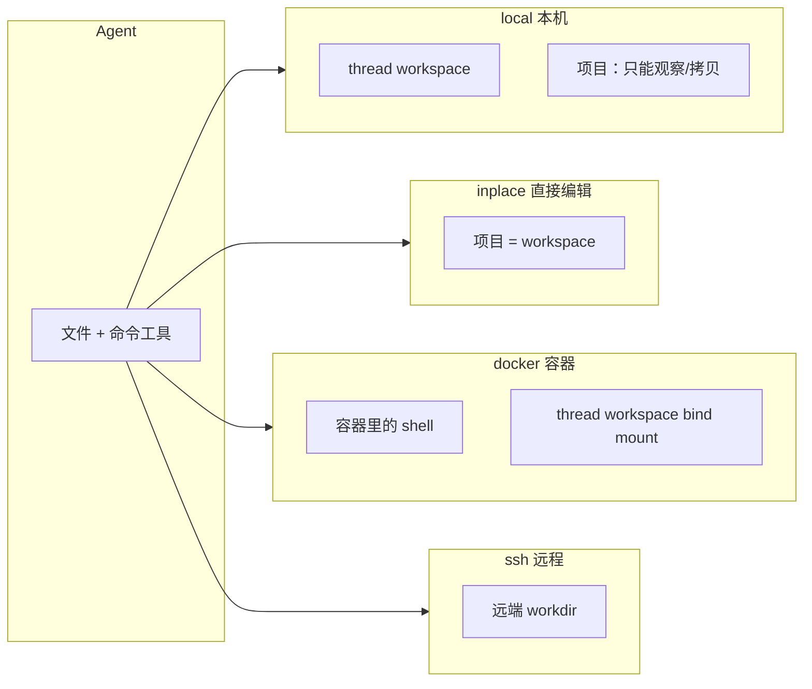

# 怎么选沙箱后端

语言：[中文](/zh/pagentv4/backends) | [English](/pagentv4/backends)

pagent 给 agent 配一台**伴身电脑**（sandbox）。面向用户的后端是 **四种并列选项**，
不是「inplace 的四种写法」：

| 配置值 | 桌面 / 插件上的名字 | 一句话 |
|--------|---------------------|--------|
| `local` | 本机 | 本机上的独立 scratch workspace |
| `inplace` | 直接编辑 | 直接改绑定的项目目录 |
| `docker` / `podman` / `container` | 容器 | 命令在容器里跑，文件仍在 thread workspace |
| `ssh` | SSH / 远程 | 命令和文件都在远端主机上 |

**`inplace` 不是 inplace-docker、也不是 inplace-ssh。** Docker、SSH、本机都不会
「按 inplace 方式改仓库」；只有 `backend = "inplace"` 才会原地写项目。

Runner / `Sandbox.create` / 错误类型见 [Sandbox](./sandbox)。本页只讲：每种后端
动哪块磁盘、什么时候选、界面上容易混的地方。

::: warning 最常见的误用：本机模式里让 agent 自己 ssh
会话开成 **`local`（本机）**，再在对话里说「ssh 到那台机器上跑」——这**不是**
`ssh` 后端。

- `run_command("ssh host …")` 只是本机 workspace 里又开了一条 ssh 子进程
- `read_file` / `write_file` / `list_dir` **仍然打在本机** `workspaces/main/`
- 审批、超时、resume、文件树看到的都是本机沙箱，远端文件 pagent 看不见

活要发生在远端时：新建任务选 **SSH / 远程**，或 `[sandbox] backend = "ssh"`。
让全部工具走同一条 asyncssh 连接，而不是让模型自己拼 `ssh` 命令。
同理：不要在 `local` 里让 agent `docker run` 来「当容器后端」。
:::

## 先记住两个目录

每个会话都有两棵根。混在一起就会觉得「四种 inplace」。

```text
Agent 看到的路径     /home/agent/...     ← 模型眼里的家
                     ↕ 由后端映射
workdir              run_command / read_file / write_file 真正落点

host_root            你本机绑定的项目
                     仅 list_host_files / copy_from_host / copy_to_host
```

| 目录 | 常见位置 | 谁用 |
|------|----------|------|
| **workdir**（agent 的电脑） | `local` / `docker`：`~/.pagent/threads/<id>/workspaces/main/` · `inplace`：项目本身 · `ssh`：远端 `~/pagent`（或 `[sandbox.ssh] workdir`） | `run_command`、`read_file`、`write_file`、`str_replace`、`list_dir` |
| **host_root**（你的项目） | `[project.local] path` 或 `--project` / 桌面「项目目录」；留空 → 启动时的 cwd | `list_host_files`、`copy_from_host`、`copy_to_host` → `<host_root>/artifacts/` |

`inplace` 把两棵根**收成同一文件夹**。宿主机桥接工具会被拿掉：已经没有「再拷一份」
的必要。



## 对照表

| | `local` | `inplace` | `docker` / `podman` | `ssh` |
|---|---|---|---|---|
| 命令跑在哪 | 本机，thread workspace | 本机，项目目录 | 容器内 | 远端主机 |
| 文件工具写到哪 | thread workspace | **项目目录** | thread workspace（bind 进容器同名路径） | 远端 workdir |
| 和仓库隔离吗 | 是，直到你拷出去 | **否** | 是，直到你拷出去 | 相对这台笔记本是隔离的 |
| 额外依赖 | 无 | 无 | Docker 或 Podman + 镜像 | SSH config + 能连上的机器 |
| 宿主机桥接工具 | 有 | **不挂** | 有 | 有 |
| 桌面「沙箱」文件 Tab | 显示 | 隐藏（看 **项目**） | 显示 | 显示 |
| 冻进 `thread.toml` | `backend` | `backend` + `project.path` | `backend` + `image` | `backend` + SSH 字段 |
| 换个 cwd 再 resume | 还是那个 workspace | **还是那个项目路径** | 还是那个 workspace | 还是那个远端目录 |

`container` 不是第五种。它从 `PATH` 里探测 `docker` 或 `podman`（优先 docker）。
`docker` 和 `podman` 是同一套设计，只是 CLI 不同。

## `local` — 本机独立 workspace

默认。最接近「给 agent 一块草稿纸」。

```text
~/.pagent/threads/<thread_id>/
  thread.toml
  messages/
  workspaces/main/     ← agent 的 /home/agent
```

绑定的项目只能通过宿主机工具**看 / 拷**。workspace 里的修改不会进仓库，除非
`copy_to_host`（写到 `artifacts/`）或你手动拷。

**适合：** 先试用 pagent、生成一次性文件、或仓库先别动、只收产物。

```toml
[sandbox]
backend = "local"

[project.local]
# path = "/path/to/repo"   # host_root；留空 = 启动时的 cwd
```

## `inplace` — 直接改项目

这就是 coding CLI 模式（`pagent -C .`）。agent 的 `/home/agent` **就是**项目。
`write_file` / `str_replace` / `run_command` 立刻打到真实目录。

必须有项目目录（`--project`、`-C`、桌面「项目目录」、或 `[project.local] path`）。
路径冻进 `thread.toml`，之后从别的目录 resume，仍改原来那个文件夹。

工具只有：`run_command`、`read_file`、`write_file`、`str_replace`、`list_dir`。
不挂 `list_host_files` / `copy_from_host` / `copy_to_host`——项目已经是工作目录。

**适合：** 想像 Cursor / Claude Code 那样改一份 git 仓库。务必用版本控制，并保留
工具审批（默认 `permission.mode = "prompt"`）。

快捷写法：

```bash
pagent -C .                    # 当前目录
pagent -C /path/to/project     # 别的目录
# 等价于：pagent --backend inplace --project <dir>
```

第一次建议用临时目录，别拿真正的仓库试：

```bash
mkdir -p /tmp/pagent-inplace-test
echo "alpha" > /tmp/pagent-inplace-test/hello.txt
pagent -C /tmp/pagent-inplace-test
```

让它把 `hello.txt` 里的 `alpha` 改成 `beta`，然后：

```bash
cat /tmp/pagent-inplace-test/hello.txt   # beta
```

对话和配置仍在 `~/.pagent/threads/`。这种模式**不会**再开一份 `workspaces/main/`。

```toml
[sandbox]
backend = "inplace"

[project.local]
path = "/path/to/project"
```

## `docker` / `podman` / `container` — 命令进容器

命令在镜像里执行。thread workspace 以**宿主机同名路径** bind mount 进容器
（`-v <workdir>:<workdir>`）。所以文件工具写的是本机 workspace，不是镜像层，
也不是你的项目（除非再用宿主机桥接工具拷）。

这**不是** inplace：仓库不会变成容器工作目录。

需要：`PATH` 里有 CLI，以及本地镜像（`[sandbox.container] image`）。缺镜像不会
自动 pull，`docker run` 失败后错误回到界面。

**适合：** 要固定的 Linux 用户态（编译器、Python、无头浏览器），又不想装到 Mac 上，
文件仍留在本机磁盘。

```toml
[sandbox]
backend = "container"   # 或 docker / podman

[sandbox.container]
image = "pagent:latest"
container_ttl = 300       # 秒；0 / 不设 = sleep infinity
```

截图 / 渲染 HTML / PDF 用 browser 镜像：

```bash
docker build -t pagent:browser -f src/app/Dockerfile.browser src/app
```

然后把 `image` 改成 `pagent:browser`。

Python：

```python
runner = await Runner.create(
    "demo",
    provider,
    overrides={"backend": "docker", "image": "python:3.12-slim"},
)
```

## `ssh` — 远端主机

`run_command` 和文件工具共用一条长连接（asyncssh）。agent 的 `/home/agent` 映射到
**远端** workdir（`[sandbox.ssh] workdir`，默认 `~/pagent`，不存在会 mkdir）。
宿主机桥接工具仍然打到**本机** `host_root`。

需要：`~/.ssh/config` 里的 `Host` 别名（User / Hostname / IdentityFile 和平时
`ssh <alias>` 一样）。连接带 `connect_timeout=10s`、`login_timeout=15s`，连不上
会尽快失败，而不是把界面卡死。

**适合：** 活必须跑在 GPU 机、超算、或已经装好工具链的那台机器上。
不要开 `local` 再让模型 `ssh`；那只会在本机再起一个客户端，文件工具仍写本机。

```toml
[sandbox]
backend = "ssh"

[sandbox.ssh]
config_path = "~/.ssh/config"
host = "machine_root"     # Host 别名，不是 user@hostname
workdir = "~/pagent"
```

```python
runner = await Runner.create(
    "remote",
    provider,
    overrides={
        "backend": "ssh",
        "ssh_host": "machine_root",
        "ssh_workdir": "~/pagent",
    },
)
```

## 怎么选

1. **先聊着、文件以后再拷** → `local`
2. **就在这份 git 仓库上改代码** → `inplace`（`pagent -C .`）
3. **要 Ubuntu 包 / 固定镜像，文件留在这台电脑** → `container` / `docker`
4. **活必须发生在另一台机器** → **`ssh` 后端**（不要开 `local` 再让模型自己 ssh）

快速判断：

- 「`write_file("app.py")` 会改我的仓库吗？」只有 **`inplace`** 会。
- 「要不要装 Docker？」只有 **容器这一家** 要。
- 「项目有没有挂进沙箱？」**`inplace`**：项目就是沙箱。**`local` / `docker`**：
  项目是 host_root，靠拷进拷出。
- 「换台笔记本 resume？」`local`/`docker` 的 workspace 在原机磁盘上；`inplace`
  绑的是原机那条项目路径；`ssh` 跟你配的远端走。

## 配置和冻结

全局 `pagent.toml` 只管**新建**对话的缺省。每个 thread 会把 backend、项目、
镜像 / SSH 冻进自己的 `thread.toml`；之后改全局文件，不会改写已有会话。

桌面 **新建任务** 可以按会话覆盖。界面文案对应：

| 界面 | `backend=` |
|------|-------------|
| 本机 | `local` |
| 直接编辑 | `inplace` |
| 容器 | `container`（或 `docker` / `podman`） |
| SSH / 远程 | `ssh` |

首次设置向导里的「沙箱」只是**偏好默认值**，每个任务仍可另选。

## 常见误解

**`local` 里让 agent 自己 `ssh` / `docker run`**  
后端决定的是**每一件工具**落在哪，不是对话里口头说的「去哪干活」。
`local` + `run_command("ssh gpu01 make")`：

| | `local` 里自己 ssh | `backend = "ssh"` |
|---|---|---|
| `run_command` | 本机起 ssh 客户端 | 远端 shell |
| `write_file("a.py")` | 本机 workspace | 远端 workdir |
| 连不上 / 超时 | 子进程挂起，界面像卡住 | 连接超时，错误回到 UI |
| 桌面文件树 | 本机 `workspaces/main/` | 远端目录 |
| 密钥 / Host | agent 自己猜命令行 | 读你的 `~/.ssh/config` |

要远端就换后端，不要把 ssh 当成 `local` 的一种用法。

**「inplace 的 docker / ssh / local 四种」**  
没有这种组合。一个 thread 只有一个 `backend`。子 agent 可以单独写
`[sub.<name>] backend`（或 `"none"`），那也不是「inplace 套 docker」。

**`local` 和 `inplace`**  
都在本机跑。`local` = 草稿纸。`inplace` = 仓库本身。

**`docker` 和 `inplace`**  
Docker 隔离的是 *shell*，不是你的项目。文件落在 `workspaces/main/`，除非你再拷。

**`local` / `docker` / `ssh` 上的 `[project.local] path`**  
那是 host_root（观察 / 拷贝），不是命令的 cwd。只有 `inplace` 把它当成 workdir。

**`container` vs `docker` vs `podman`**  
同一类后端。`container` 自动探测。两套 CLI 都在时，想钉死就写 `docker` 或 `podman`。

**`inplace` 没选项目**  
没有目录会直接报错（必须有 `project_path`）。

**SSH 连不上就停不下来**  
以前 `connect` 没有超时，会堵住整条 wire。现在连接会超时；状态轮询也不会去唤醒
沙箱。仍连不上时查 Host 别名、密钥和网络。

**`command_policy = "workdir"`**  
四种后端都生效：`run_command` 不能带沙箱 workdir 以外的路径。`open` 关掉这项检查。

## 相关

- [Sandbox API](./sandbox) — `Runner.create`、工具、限额、错误
- [工具](./tools) — 八个沙箱工具
- [桌面端](/zh/desktop) — 本机 / 直接编辑 / 容器 / 远程
- [VS Code](/zh/vscode) — `pagent.toml` 的 `[sandbox]`
- 全字段模板：`src/template/pagent.toml`
